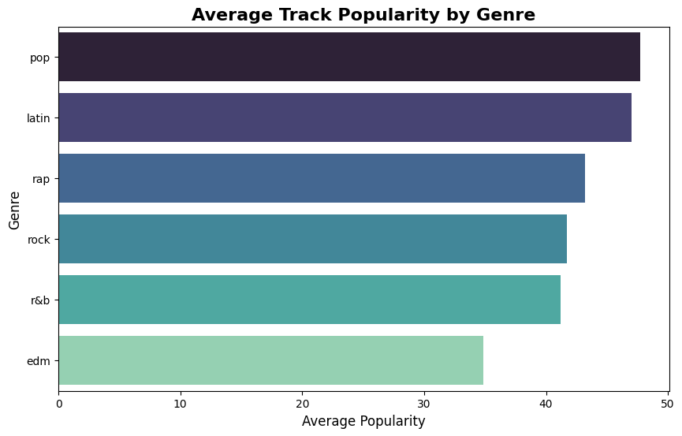
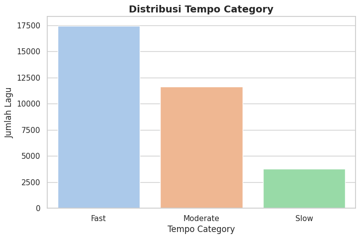
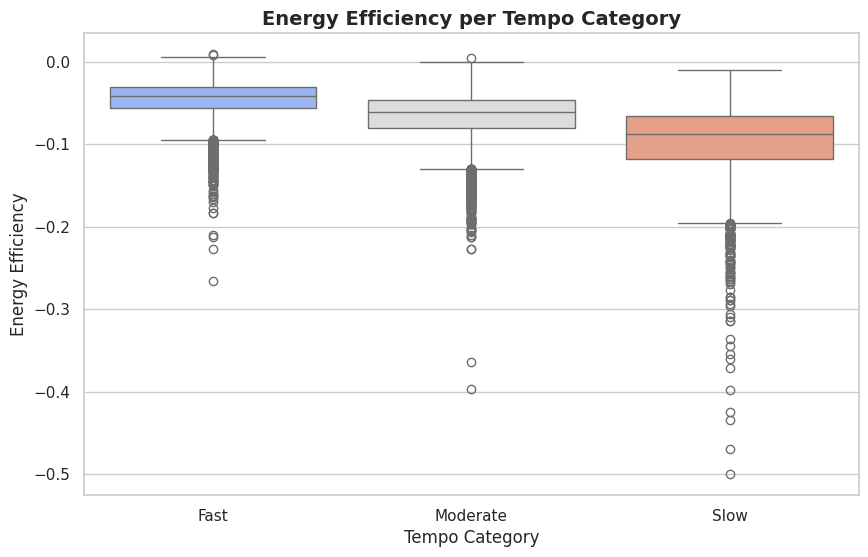
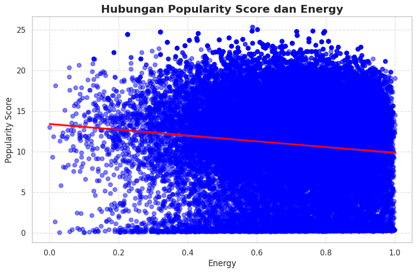
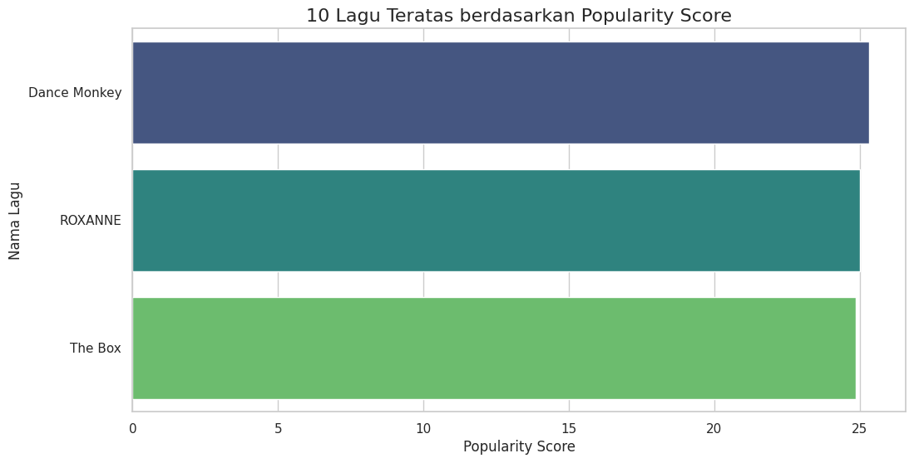

# Spotify Genre Data Analysis

## 📖 Pendahuluan  
Spotify menghadapi tantangan dalam mempertahankan engagement pengguna akibat kesulitan memberikan rekomendasi musik yang tepat sesuai preferensi individu. Masalah ini penting karena pengalaman mendengarkan yang personal dan relevan dapat meningkatkan loyalitas pengguna serta memaksimalkan waktu yang dihabiskan di platform. Dengan demikian, analisis data ini bertujuan untuk memberikan wawasan yang mendalam terkait preferensi musik pengguna.

## 🛠️ Rencana dan Pendekatan  
Kami menggunakan dataset open source dari [Github](https://github.com/rfordatascience/tidytuesday/blob/main/data/2020/2020-01-21/readme.md) yang mencakup metadata lagu Spotify, seperti:  
- **Karakteristik audio** (*danceability*, *energy*, *tempo*, *valence*).  
- **Genre playlist** dan tingkat popularitas.  
- **Durasi lagu** dan struktur tonal (*key* dan *mode*).  

### **Metodologi**  
- **Pembersihan Data**: Mengatasi kekosongan data dengan nilai default.  
- **Eksplorasi Data Awal (EDA)**: Menggali pola perilaku pengguna dengan statistik deskriptif.  
- **Visualisasi Data**: Membantu memahami hubungan antar variabel secara intuitif.

## 🔍 Teknik Analisis yang Digunakan
**!!Kami Belum Melakukan Evaluasi Model maupun Eksperimen Model, Projek ini dilakukan sebagai bentuk tanjung jawab terhadap kami sebagai mahasiswa informatika mata kuliah analisis bigdata!!**  
1. **Penambahan Fitur Baru**:  
   - *Energy Acoustic Ratio*: Rasio dominasi energi terhadap elemen akustik.  
   - *Energy Efficiency*: Efisiensi energi berdasarkan karakteristik musikal.  
   - *TEMPO CATEGORY*: Kategori berdasarkan tempo musik.  
2. **Klasifikasi Tempo Lagu**:  
   Lagu dikategorikan berdasarkan kecepatan menjadi *Fast*, *Moderate*, dan *Slow*.  
3. **Analisis Popularitas**:  
   Hubungan antara genre playlist dan skor popularitas disajikan melalui heatmap, scatter plot, dan boxplot.  

## 🌟 Manfaat Analisis  
Hasil analisis ini diharapkan dapat:  
- Mengoptimalkan algoritma rekomendasi musik Spotify.  
- Memberikan pengalaman mendengarkan yang lebih personal dan relevan bagi pengguna.  
- Membantu tim produk Spotify meningkatkan engagement platform.  

Dengan analisis ini, Spotify dapat lebih memahami kebutuhan pengguna dan menciptakan pengalaman mendengarkan yang menarik dan memuaskan.

## 📂 Struktur Proyek  
- **Dataset**: `spotify_songs.csv` (Metadata lagu Spotify).  
- **Kode Analisis**: `spotify.ipynb`.  
- **Visualisasi**: Disimpan di folder `asset/`.  

## 📂 Library
1. **gdown**:  
   *Mengunduh data dari Google Drive.*
2. **pandas (pd)**: *Library utama yang digunakan untuk manipulasi dan analisis data dalam bentuk tabel (DataFrame).*
3. **matplotlib (plt)**: *Library visualisasi data yang digunakan untuk membuat grafik dan plot.*
4. **seaborn (sns)**: *Dibangun di atas matplotlib dan menyediakan cara yang lebih mudah dan lebih estetik.*  

## 🧹 Data Preparation  
Sumber dataset berasal dari [Github](https://github.com/rfordatascience/tidytuesday/blob/main/data/2020/2020-01-21/readme.md). Dataset ini berupa **Data Tabular** yang berisi metadata lagu-lagu Spotify, dirilis pada 2 Januari 2020. Dataset terdiri dari **32.832 baris** dan **23 kolom** dengan tipe data:  
- **String**: 10 kolom.  
- **Numerik**:  
  - *float64*: 9 kolom.  
  - *int64*: 4 kolom.  

### **Karakteristik Data**  
1. **Karakteristik Audio**: *“danceability”*, *“energy”*, *“tempo”*, dan *“valence”* sebagai metrik numerik.  
2. **Durasi Lagu**: *“duration_ms”*, mengukur panjang lagu.  
3. **Struktur Tonal**: *“key”* (nada dasar) dan *“mode”* (mayor/minor).  
4. **Genre yang Tercakup**: Pop, Latin, Rap, Rock, R&B, dan EDM dengan tingkat popularitas yang seimbang.  

### **Proses Cleaning Data**  
#### 1. Mengatasi Kekosongan Data  
Dataset memiliki kekosongan data pada kolom `track_name`, `track_artist`, dan `track_album_name` (5 baris). Kekosongan diatasi dengan:  
- **String**: Diimput nilai "Unknown".  
- **Numerik**: Diimput nilai `0`.  

#### 2. Membersihkan Angka, Karakter, dan Simbol Khusus  
Pada kolom `track_name`, dilakukan pembersihan angka, karakter, dan simbol khusus untuk memastikan data lebih konsisten dan siap dianalisis. Proses ini menggunakan pendekatan regex (*regular expressions*), seperti:  
- Menghapus angka: `\d+`  
- Menghapus simbol khusus: `[^\w\s]`  
- Menjaga huruf dan spasi saja: `[a-zA-Z\s]`  

#### Tabel Before dan After Cleaning  
| **ID** | **Track ID**          | **Track Name** | **Track Artist** | **Track Album Name** | **Duration_Ms** | **DateAdded** |  
|--------|------------------------|----------------|------------------|----------------------|--------------|----------------|  
| 8151   | 69gRFGOWY9OMpFJgFol1u0 | NaN            | NaN              | NaN                  | 0            | 2012-01-05     |  
| ...    | ...                    | NaN            | NaN              | NaN                  | ...          | ...            |  

*Setelah Cleaning*:  

| **ID** | **Track ID**          | **Track Name** | **Track Artist** | **Track Album Name** | **Duration_Ms** | **DateAdded** |  
|--------|------------------------|----------------|------------------|----------------------|--------------|----------------|  
| 8151   | 69gRFGOWY9OMpFJgFol1u0 | Unknown        | Unknown          | Unknown              | 0            | 2012-01-05     |  
| ...    | ...                    | Unknown        | Unknown          | Unknown              | ...          | ...            |

## 📊 Exploratory Data Analysis (EDA)  

EDA bertujuan untuk menggali pola dan wawasan awal dari dataset Spotify. Berikut adalah temuan informasi yang kami dapatkan:  

### **1. Penambahan Kolom Baru**: Kolom *"tempo_category"* mengindikasikan kategori tempo lagu berdasarkan kecepatannya, yang terbagi dalam tiga kategori: *Fast*, *Moderate*, dan *Slow*, Kolom *"energy_acoustic_ratio"* merepresentasikan rasio dominasi energi dibandingkan dengan elemen akustik dalam lagu. Kolom *"energy_efficiency"* mengukur tingkat efisiensi energi lagu berdasarkan metrik tertentu.  

| **Track Name**                                   | **Tempo Category** | **Energy Acoustic Ratio** | **Energy Efficiency** |
|--------------------------------------------------|--------------------|---------------------------|-----------------------|
| I Dont Care with Justin Bieber Loud Luxury Remix | Fast               | 8.980304	                | -0.021584             |
| Memories - Dillon Francis Remix                  | Moderate           | 11.256751		            | -0.049704             |
| ...                                              | ...                | ...		                | ...                   |

### **2. Analisis Korelasi**  
Kolom *"track_name", "track_artist", dan "track_popularity"* : 

| **Track Name**                                   | **Track Artist** | **Track Popularity** | 
|--------------------------------------------------|------------------|----------------------|
| I Dont Care with Justin Bieber Loud Luxury Remix | Ed Sheeran       | 66	                 |
| Memories - Dillon Francis Remix                  | Maroon 5         | 67		             |
| ...                                              | ...              | ...		             |

### **3. Top Genre**
    
Dilakukan filter untuk menampilkan 10 lagu berdasarkan Track Popularity dan Playlist Genre.  

### **4. Visualisasi Tempo Category dan Kontribusi dengan Energy Efficiency**  
    
Musik dikategorikan menjadi *Fast* (tempo > 120 BPM), *Moderate* (90-120 BPM), dan *Slow* (< 90 BPM). Rata-rata popularitas tertinggi ditemukan pada Musik *Moderate*.  

    
kontribusi antara Tempo Category dan Energy Efficiency.

Distribusi tempo:  
| **Tempo Kategori** | **Rata-rata Energy** | **Rata-rata Accousticness** | **Rata-rata Loudness** | **Rata-rata Energy Efficiency** |  
|--------------------|----------------------|-----------------------------|------------------------|---------------------------------|
| Fast               | 0.730837	            | 0.144768	                  | -6.393295	           | -0.046125                       |
| Moderate           | 0.685130	            | 0.186271                    | -6.862769	           | -0.066358                       |
| Slow               | 0.590837	            | 0.283334	                  | 7.790155               | -inf                            |

Data ini menunjukkan rata-rata energi, acousticness, loudness, dan efisiensi energi berdasarkan kategori tempo lagu. Kategori “Fast” memiliki nilai energi tertinggi, sementara kategori “Slow” memiliki nilai acousticness dan loudness tertinggi, namun efisiensi energinya tidak terukur.

### **5. Korelasi antara Popularity Score berdasarkan Playlist Genre dan Energy**  
    
    

### **5. Penyajian Top 10 lagu teratas berdasarkan kolom Track Name, Track Artist, Track Popularity, Popularity Score, dan Playlist Genre**
    

### **6. Kesimpulan**  
Analisis informasi data berdasarkan data genre musik Spotify untuk meningkatkan pengalaman pengguna. *Dataset* dikategorikan berdasarkan tempo (Fast, Moderate, Slow), dengan *temuan* bahwa lagu Fast memiliki energi tertinggi, sementara Slow unggul dalam acousticness dan loudness. *Penambahan kolom* seperti tempo category, energy acoustic ratio, dan energy efficiency memberikan wawasan baru terkait fitur musikal. *Analisis* juga menyoroti hubungan antara genre dan popularitas lagu, serta menyajikan 10 lagu teratas berdasarkan popularitas. Data telah dibersihkan untuk mengatasi kekosongan dengan nilai default. Selain itu, dilakukan pembersihan terhadap simbol atau karakter tertentu yang memengaruhi kualitas data. Proses ini memastikan data siap untuk analisis lebih lanjut. Visualisasi data membantu memahami distribusi dan hubungan antar variabel dengan lebih jelas.

---

## 🤝 Kontribusi  
Kami selalu terbuka untuk saran dan kolaborasi. Jangan ragu untuk membuka *issue* atau *pull request*.  

---

**Dibuat oleh Tim Spotify Genre Analysis**  
**Dosen Pengampu: Yuda Munarko, S.Kom., M.Sc.**  
**Anggota Kelompok**:  
   - *Muhammad Wahyudi - 202110370311234*
   - *Abd. Baasithur Rizqu - 202110370311234*
   - *Alji Afrian - 202110370311234*